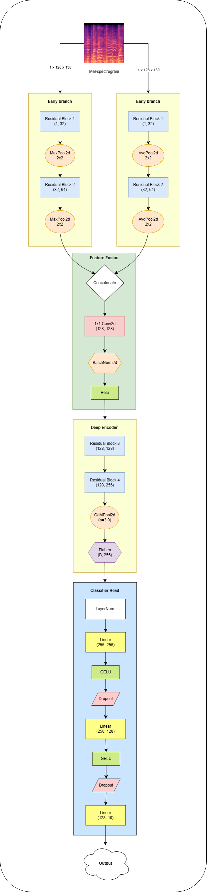

# Tri-P: Triple Pooling Residual Network for Music Genre Classification

Music Genre Recognition from audio signals is a vital task in music information retrieval, as it provides a compact semantic representation that supports better understanding in audio and multimedia analysis. Many recent approaches rely on deep and computationally intensive architectures to achieve high performance, but simple methods can still achieve good result. In this paper, we propose a new architecture that focuses on efficient feature extraction through a triple-pooling strategy and residual blocks. Each pooling layer is designed to capture complementary statistical characteristics from feature maps in different ways, which are then fused to obtain a comprehensive representation. Meanwhile, residual connections help stabilize feature propagation during the training process. Experimental results demonstrate the effectiveness of our proposed model, which achieves 90.4\% accuracy on the GTZAN dataset and 83.08\% on a private dataset. This indicates that the hybrid pooling mechanism and lightweight residual architecture are not only able to provide strong performance but also maintain an efficient model design.

